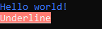

# Control Terminal

- Control terminal cursor
- Terminal string styling

## Installation

Install using pnpm:

```shell
pnpm add control-terminal
```

Or yarn:

```shell
yarn add control-terminal
```

Or npm:

```shell
npm i control-terminal
```

## Usage

```typescript
import * as terminal from 'control-terminal';

console.log(terminal.style.bold.blue('Hello world!'));
console.log(terminal.style.bgBlue.hex('#ff7b72')('Blue backgroud'));

terminal.cursor.erasePreviousLine();

console.log(terminal.style.bgRgb(255, 123, 114).underline('Underline'));
```

Output:



## Cursor

The methods in `terminal.cursor` namespace will help you control cursor and terminal.

Moving cursor methods:

- `goTo(line: number, column: number)`: Move the cursor to a specific position (line >= 1, column >= 1)
- `gotoStart()`: Move the cursor to line 1, column 1
- `carriageReturn()`: Move the cursor to start of line
- `up(line: number = 1)`: Move the cursor up `line` lines
- `down(line: number = 1)`: Move the cursor down `line` lines
- `forward(column: number = 1)`: Move the cursor forward `column` columns
- `backward(column: number = 1)`: Move the cursor backward `column` columns
- `previousLine()`: Move the cursor up 1 line, column 1

Clear screen methods:

- `clearScreen()`: Clear the screen
- `reset()`: Reset device
- `eraseCurrentLine()`: Erase the current line of the cursor
- `eraseToEndLine()`: Erase to the end of line that begins the cursor's current position
- `eraseToEndScreen()`: Erase to the end of screen that begins the cursor's current position
- `erasePreviousLine(line: number = 1)`: Erase the previous line from the cursor

Other:

- `hide()`: Hide cursor
- `save()`: Save cursor position
- `restore()`: Restore cursor position

## Styles

The `terminal.style` namespace will help you string styling.

Modifiers:

- `reset`: Resets the current color chain.
- `bold`: Make text bold.
- `dim`: Emitting only a small amount of light.
- `italic`: Make text italic. _(Not widely supported)_
- `underline`: Make text underline. _(Not widely supported)_
- `slowBlink`: Make text slow blink. _(Not widely supported)_
- `rapidBlink`: Make text rapid blink. _(Not widely supported)_
- `inverse`: Inverse background and foreground colors.
- `hidden`: Prints the text, but makes it invisible.
- `strikethrough`: Puts a horizontal line through the center of the text. (Not widely supported)
- `fraktur`: Make text fraktur. _(Not widely supported)_
- `framed`: Make text framed. _(Not widely supported)_
- `encircled`: Make text encircled. _(Not widely supported)_
- `overline`: Make text overline. _(Not widely supported)_

Colors:

- `black`
- `red`
- `green`
- `yellow`
- `blue`
- `magenta`
- `cyan`
- `white`
- `blackBright`
- `redBright`
- `greenBright`
- `yellowBright`
- `blueBright`
- `magentaBright`
- `cyanBright`
- `whiteBright`

Background colors:

- `bgBlack`
- `bgRed`
- `bgGreen`
- `bgYellow`
- `bgBlue`
- `bgMagenta`
- `bgCyan`
- `bgWhite`
- `bgBlackBright`
- `bgRedBright`
- `bgGreenBright`
- `bgYellowBright`
- `bgBlueBright`
- `bgMagentaBright`
- `bgCyanBright`
- `bgWhiteBright`

Example:

```js
console.log(terminal.style.bold.bgCyan.green('Hello'));

console.log(terminal.style.italic.bgBlack.white.underline('Hello'));

console.log(terminal.style.white.inverse.bgMagentaBright('Hello'));
```

### True color support

Control Terminal support True color (16 million colors) on terminal applications.

The following color models can be used:

RGB:

- `rgb(red: number, green: number, blue: number)`

```js
terminal.style.rgb(88, 166, 255)('Blue text');
```

- `bgRgb(red: number, green: number, blue: number)`

```js
terminal.style.bgRgb(88, 166, 255)('Blue background ');
```

Hex:

- `hex(hex: string)`

```js
terminal.style.hex('#58a6ff')('Blue text');
```

- `bgHex(hex: string)`

```js
terminal.style.bgHex('#58a6ff')('Blue background ');
```
